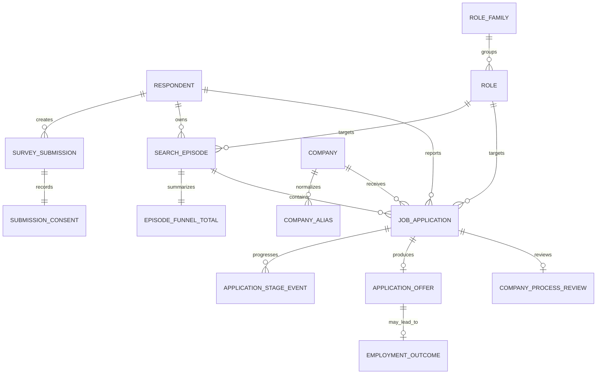

# Benchmark raporlama veri modeli — v0.1

Durum: Ön çalışma  
Kapsam: `02 / İşe alım verileri`, detaylı benchmark sayfası, Anket 01 ve Anket 02'nin gelecekteki veri katmanı  
Bu doküman migration değildir; backend ve Supabase şeması uygulanmadan önce veri tanesini ve metrik tanımlarını sabitler.

## 1. Ana karar

Raporlama iki farklı kayıt tanesiyle kurulmalı:

1. `search_episode`: Bir adayın belirli rol/pazar için yürüttüğü iş arama dönemi. Kişisel karşılaştırma ve “olgun iş arama dönemlerinin yüzde kaçı doğrulanmış işe başlangıçla bitti?” metriğinin kaynağıdır.
2. `job_application`: Tek bir şirkete, tek bir rol için yapılan başvuru. Şirket hunisi ile meslek × ay başvuru hacminin kaynağıdır.

Mevcut başvuru benchmark formundaki dönem toplamları birkaç aya ve birçok şirkete yayıldığı için gerçek aylık veya şirket bazlı rapora dağıtılamaz. Toplamlar `search_episode` üzerinde korunur; ayrıntılı raporlar yalnız tekil başvuru kayıtlarından üretilir.

Teklif kabulü “işe girdi” değildir. `offer_accepted` ve doğrulanmış `employment_started` ayrı tutulur.

## 2. Kavramsal model



## 3. Önerilen tablolar

### Kimlik, gönderim ve izin

| Tablo | Temel alanlar | Not |
| --- | --- | --- |
| `respondents` | `id uuid`, `auth_user_id uuid?`, `anonymous_key_hash text?`, `created_at`, `deleted_at` | Hesapsız kullanıcı için tarayıcıdaki rastgele tokenın sunucu HMAC'i tutulur. IP veya fingerprint kalıcı kimlik değildir. |
| `survey_submissions` | `id`, `respondent_id`, `survey_type`, `schema_version`, `locale`, `idempotency_key`, `moderation_status`, `quality_status`, `submitted_at` | Her POST için denetlenebilir zarf. |
| `submission_consents` | `submission_id`, `privacy_notice_version`, `analytics_consent_at`, `public_aggregate_consent_at`, `withdrawal_token_hash` | Gizlilik metni ve geri çekme yetkisi versiyonlanır. |
| `submission_notes` | `submission_id`, `raw_text_encrypted`, `redacted_text`, `pii_scan_status`, `moderation_status` | Serbest metin hiçbir public view'a girmez. |

### Kataloglar

| Tablo | Temel alanlar | Not |
| --- | --- | --- |
| `role_families` | `id`, `slug`, `taxonomy_version`, `active` | Yazılım, veri ve yapay zekâ, ürün, tasarım gibi yayın kırılımı. |
| `roles` | `id`, `family_id`, `slug`, `display_name`, `active` | Formdaki kanonik rol seçimi. |
| `companies` | `id`, `slug`, `legal_name`, `display_name`, `sector_id`, `country_code`, `verification_status` | Public şirket raporunun kanonik kaydı. |
| `company_aliases` | `company_id`, `normalized_alias`, `source`, `review_status` | Farklı yazım ve marka adlarını tek şirkete eşler. |
| `compensation_bands` | `id`, `currency`, `period`, `gross_net`, `lower_bound`, `upper_bound`, `region`, `valid_from`, `valid_to` | Para birimi ve brüt/net bağlamı olmadan maaş bandı karşılaştırılmaz. |

### İş arama dönemi

| Tablo | Temel alanlar |
| --- | --- |
| `search_episodes` | `id`, `respondent_id`, `role_id`, `role_level`, `experience_band`, `target_region`, `sector_id?`, `employment_type?`, `work_mode?`, `started_month`, `ended_month?`, `status`, `currently_employed`, `counts_are_estimated`, `observed_through`, timestamps |
| `episode_funnel_totals` | `episode_id`, `applications_count`, `human_responses_count`, `any_interviews_count`, `hr_interviews_count`, `technical_interviews_count`, `offers_count`, `accepted_offers_count`, `employment_started_count` |

`search_episode.status` başlangıç sözlüğü:

- `ongoing`
- `offer_accepted`
- `employment_started`
- `offer_rejected`
- `abandoned`

### Tekil başvuru ve aşamalar

| Tablo | Temel alanlar |
| --- | --- |
| `job_applications` | `id`, `submission_id`, `episode_id?`, `respondent_id`, `company_id`, `role_id`, `role_level`, `target_region`, `application_channel`, `had_referral`, `applied_on`, `date_precision`, `observed_through`, `terminal_outcome`, timestamps |
| `application_stage_events` | `id`, `application_id`, `stage_code`, `event_kind`, `occurred_on`, `date_precision`, `sequence_no`, `source_submission_id` |
| `application_offers` | `id`, `application_id`, `offered_on`, `status`, `compensation_band_id?`, `currency?`, `pay_period?`, `gross_net?` |
| `employment_outcomes` | `id`, `offer_id`, `accepted_at?`, `planned_start_at?`, `started_at?`, `start_confirmed_at?`, `status` |
| `company_process_reviews` | `application_id`, `promised_days?`, `actual_response_days?`, `was_ghosted`, `ghosted_after_stage?`, `feedback_type`, `process_transparency`, `hr_professionalism`, `would_recommend` |

Önerilen aşama kodları:

```text
applied
auto_acknowledged
auto_rejected
human_response
hr_screen
assessment
technical_interview
manager_interview
final_interview
offer_received
offer_accepted
offer_declined
employment_started
rejected
withdrawn
ghosted
```

`auto_acknowledged` insan dönüşü sayılmaz. `interviewed`, aynı başvurunun İK/teknik/final aşamalarına birden fazla kez ulaşması halinde yalnız bir kez sayılır.

## 4. Formlarda tutulması gereken ek veriler

### Başvuru benchmark formu

Mevcut dönem toplamlarına şu alanlar eklenmeli:

- `humanResponsesCount`: otomatik alındı e-postası hariç.
- `anyInterviewCount`: en az bir görüşmeye ulaşan benzersiz başvuru.
- `acceptedOffersCount`.
- `employmentStartedCount`.
- `countsAreEstimated`.
- Gerçek aylık trend isteniyorsa tekil başvuru ekleme veya tekrar doldurulabilir aylık snapshot.

### Şirket deneyimi formu

- Kanonik şirket ve rol.
- Başvuru ayı; tam gün opsiyonel.
- Başvuru kanalı ve referans bilgisi.
- İnsan dönüşü / otomatik ret ayrımı.
- Ulaşılan aşamalar ve aşama ayları.
- Sonuç: devam ediyor, ret, ghosting, çekilme, teklif.
- Teklif kabulü ve gerçek işe başlangıç ayrı alanlar.
- `observedThrough`: devam eden/yanıtsız kaydın hangi güne kadar gözlendiği.
- Kabul edilen teklifte opsiyonel para birimi, aylık/yıllık, net/brüt ve maaş bandı.

Şirket adı için gizlilik metni “şirket adı yayınlanmaz” dememeli. Doğru ifade: “Tekil yanıt yayınlanmaz; şirket yalnız moderasyon ve minimum örneklem eşiği sonrası toplu raporda gösterilir.”

## 5. Metrik sözlüğü

| Metrik | Pay | Payda | Kaynak |
| --- | --- | --- | --- |
| Aylık başvuru | Başvuru kaydı | — | `job_applications.applied_on` ayı |
| İnsan dönüş oranı | `human_response = true` tekil başvuru | Sonuç penceresi dolmuş uygun başvuru | application fact |
| Mülakat oranı | Herhangi bir görüşmeye ulaşan tekil başvuru | Uygun başvuru | application fact |
| Teklif oranı | Teklif alan tekil başvuru | 90 günlük pencereyi tamamlamış başvuru | application fact |
| Şirket işe başlangıç oranı | Doğrulanmış işe başlangıcı olan başvuru | 180 günlük pencereyi tamamlamış başvuru | application + employment outcome |
| Rolde iş bulma oranı | Doğrulanmış işe başlangıcı olan iş arama dönemi | Olgun/kapanmış iş arama dönemi | search episode |
| Kabul edilen maaş | Aynı para birimi + periyot + net/brüt grubunda medyan bant | Maaş paylaşan uygun ve eşik üstü kayıtlar | offer + compensation band |

“Adayların yüzde kaçı iş buldu?” şirket başvuru oranından türetilmez; olgun `search_episode` kohortu üzerinden raporlanır.

## 6. Kohort olgunluğu

Başvuru yapıldığı aya yazılır; daha sonra gelen sonuçlar aynı geçmiş kohortu günceller. Güncel ayda hacim yayınlanabilir fakat erken sonuçlar başarısız sayılmaz.

Başlangıç gözlem pencereleri:

- İnsan dönüşü: terminal sonuç veya en az 30 gün.
- Teklif: terminal sonuç veya en az 90 gün.
- Gerçek işe başlangıç: doğrulama veya en az 180 gün.

API her metrik için `eligible_n`, `contributors_n`, `cohort_maturity`, `as_of` ve `metric_definition_version` döndürmeli.

## 7. Public raporlama view'ları

| View | Amaç |
| --- | --- |
| `analytics.application_facts` | Her başvuru için responded/interviewed/offered/accepted/started projection. Public değildir. |
| `analytics.mv_role_month_funnel` | Başvuru ayı × rol ailesi funnelı. |
| `analytics.mv_role_month_search_success` | İş arama başlangıç ayı × rol; olgun dönem ve doğrulanmış işe başlangıç oranı. |
| `analytics.mv_company_month_funnel` | Şirket × başvuru kohort ayı. |
| `analytics.mv_company_rolling_12m` | Aylık örneklemi düşük şirketler için son 12 ay funnelı. |
| `analytics.mv_company_process_quality_12m` | Ghosting, yanıt süresi, feedback ve süreç kalitesi. |
| `analytics.mv_company_salary_12m` | Şirket × rol ailesi × currency/pay-period için medyan bant. |
| `analytics.mv_sample_coverage` | Hangi kırılımların yayın eşiğini geçtiği. |

Public view satırı en az şunları taşımalı:

```json
{
  "contributors_n": 32,
  "eligible_n": 48,
  "sample_size_band": "25-49",
  "cohort_maturity": "mature",
  "as_of": "2026-07-12",
  "metric_definition_version": "1.0",
  "suppressed": false
}
```

## 8. Gizlilik ve yayın eşikleri

Önerilen başlangıç politikası:

- Rol ailesi × ay funnelı: en az 20 başvuru ve 10 farklı respondent.
- Şirket geneli, rolling 12 ay: en az 30 başvuru ve 20 farklı respondent.
- Şirket × rol × ay: en az 50 başvuru ve 30 farklı respondent.
- Maaş: en az 30 maaş yanıtı ve 20 farklı respondent; çeyreklik dağılım için en az 50 yanıt.

Ek korumalar:

- Tek respondent bir hücrenin %10'undan fazlasını oluşturamaz.
- Eşik altı sonuç `0` değil `suppressed` döner ve arayüz “Yetersiz örneklem” gösterir.
- Exact ay+rol+şirket eşiği geçmezse çeyrek → rolling 12 ay → rol ailesi → sektör fallback'i uygulanır.
- Küçük grupta exact `n` yerine `10–24`, `25–49`, `50+` bandı tercih edilebilir.
- Serbest metin, tam tarih ve respondent kimliği public view'a girmez.
- Complementary suppression, diğer hücrelerden gizli sayının hesaplanmasını engeller.

## 9. Backend sınırı ve API taslağı

Formlar doğrudan Supabase tablolarına yazmamalı. Next.js Route Handler veya ayrı API şu sırayı yürütmeli:

1. Şema ve semantik validasyon.
2. Rate limit ve bot kontrolü.
3. `idempotency_key` kontrolü.
4. Şirket/rol kanonikleştirme.
5. PII ve kalite kontrolü.
6. Tek transaction içinde submission + domain kayıtları.
7. Aggregate refresh kuyruğu.

Önerilen uçlar:

```text
POST /api/v1/search-episodes
POST /api/v1/job-applications
PATCH /api/v1/job-applications/:id/outcome
POST /api/v1/employment-follow-ups/:token

GET /api/v1/benchmarks/roles?period=6m&region=turkiye
GET /api/v1/benchmarks/companies?period=12m&region=turkiye
GET /api/v1/benchmarks/companies/:slug
```

GET uçları serbest `groupBy` kabul etmemeli; izin verilen filtre kombinasyonları allowlist olmalı. Raw tablolar service role dışında kapalı tutulmalı. Anon/authenticated roller raw tablo `SELECT` yetkisi almamalı; public istemci yalnız suppression uygulanmış aggregate view/RPC okuyabilmeli.

## 10. Önerilen uygulama sırası

1. Respondent, submission, consent ve rol/şirket katalogları.
2. Mevcut Anket 02 payload'ını `search_episode + episode_funnel_totals` olarak kaydetme.
3. Şirket anketini tekil application outcome toplayacak şekilde genişletme.
4. Stage event, offer ve employment follow-up akışı.
5. Önce rol-ay ve şirket rolling-12-ay view'ları.
6. Yeterli veri oluşunca şirket-ay, rol kırılımı ve maaş raporları.

İlk production benchmark yayınlanmadan önce metrik sözlüğü, gizlilik eşikleri ve şirket itiraz/düzeltme süreci ürün politikası olarak ayrıca versiyonlanmalıdır.

## 11. Süreç temposu matrisleri

İlk sürümde gün × saat heatmap'i yayınlanmaz. Mevcut formlar başvuru ve dönüş olaylarını güvenilir saat hassasiyetiyle toplamadığı için saat dilimi dönüşümü, saatlik dağılım veya “başvurmak için en iyi zaman” iddiası üretilemez. Opsiyonel tam gün bilgisi ileride yalnız betimleyici tarih kohortları için kullanılabilir; nedensel bir başvuru önerisine dönüştürülmemelidir.

`02 / Aday ve şirket hareketliliği` raporu, mevcut `search_episode + episode_funnel_totals` ve `company_process_reviews` alanlarından üretilebilen iki ayrı matrise dayanır.

### Aday arama temposu matrisi

Satırlar iş arama döneminin gözlenen süresini, sütunlar adayın normalize aylık başvuru temposunu gösterir. Ay hassasiyetindeki kayıtlar için süre ve tempo şu şekilde hesaplanır:

```text
observed_months = max(
  1,
  started_month ile coalesce(ended_month, observed_through) arasındaki kapsanan takvim ayı
)

monthly_application_pace = applications_count / observed_months
```

Önerilen başlangıç bantları:

- Arama süresi: `1 ay`, `2–3 ay`, `4–6 ay`, `7+ ay`.
- Aylık başvuru temposu: `1–4`, `5–9`, `10–19`, `20+` başvuru.

Her hücre iki sonuç metriği arasında geçiş yapabilir:

```text
human_response_rate = sum(human_responses_count)
                      --------------------------
                      sum(applications_count)

offer_rate = sum(offers_count)
             -----------------------
             sum(applications_count)
```

Payda hücredeki uygun iş arama dönemlerine ait toplam başvuru sayısıdır; dönem sayısı değildir. Hücre ayrıca `contributors_n` ile kaç farklı iş arama döneminin katkı verdiğini ve `eligible_applications_n` ile oranın gerçek paydasını döndürmelidir. `human_responses_count`, otomatik alındı mesajı hariç insan dönüşü alan benzersiz başvuru sayısı olarak doğrulanmalıdır. İK ve teknik görüşme alanları aynı başvuruda çakışabileceği için bu iki alan toplanarak genel mülakat oranı üretilmez.

Devam eden veya henüz olgunlaşmamış dönemler başarısız kabul edilmez. İnsan dönüşü oranı için 30 günlük, teklif oranı için 90 günlük gözlem kuralı uygulanır; ilgili metrik için olgunlaşmayan dönem o hücrenin paydasına girmez. Bölüm 8'deki minimum örneklem ve suppression kuralları her hücreye ayrı uygulanır.

Önerilen view:

```text
analytics.mv_candidate_search_tempo
```

### Şirket dönüş temposu matrisi

Satırlar şirketin adaya bildirdiği dönüş süresi bandını, sütunlar adayın bildirdiği gerçekleşen dönüş süresini gösterir. `promisedTimeline = no` kayıtları ayrı bir `süre verilmedi` satırında tutulur; `promisedTimeline = yes` iken `promised_days` eksikse kayıt geçersizdir ve “süre verilmedi” sayılmaz.

Önerilen başlangıç bantları:

- Söz verilen süre: `süre verilmedi`, `0–3 gün`, `4–7 gün`, `8–14 gün`, `15+ gün`.
- Gerçekleşen dönüş: `0–3 gün`, `4–7 gün`, `8–14 gün`, `15–30 gün`, `31+ gün`, `yanıtsız bildirildi`.

Mevcut İK süreç formunda `was_ghosted = true` olarak bildirilen kayıt `yanıtsız bildirildi` sütununa girer; bu sütun nesnel bir 30 günlük sessizlik ölçümü değildir. `was_ghosted = false` kayıtları geçerli `actual_response_days` değerine göre tek bir süre bandına girer. `actual_response_days = null` tek başına yanıtsızlık anlamına gelmez. Her hücre satır içindeki payı ve örneklemi döndürür:

```text
cell_share = hücredeki uygun süreç sayısı
             ---------------------------
             satırdaki uygun süreç sayısı
```

Nesnel `30 günde anlamlı güncelleme yok` metriği bu matristen ayrı tutulmalıdır. Bu üretim metriği için `job_application.applied_on`, `observed_through` ve anlamlı aşama olayları zorunludur:

```text
no_substantive_update_rate_30d = 30 günde anlamlı güncelleme almayan uygun başvuru
                                 -----------------------------------------------
                                 30 günlük sonucu gözlenebilen uygun başvuru
```

View her satır için en az `eligible_n`, her hücre için `count` ve `cell_share`, tüm matris için `contributors_n`, `as_of` ve `metric_definition_version` döndürmelidir. Arayüz mevcut formdan gelen sütunu açıkça “yanıtsız bildirildi” diye adlandırmalı; “30 gün içinde güncelleme yok” dilini yalnız gerekli gözlem alanlarıyla hesaplanan ayrı üretim metriğinde kullanmalıdır. Şirketler arası olumsuz karşılaştırmalarda rolling 12 ayda en az 50 uygun başvuru ve 30 farklı aday eşiği korunmalıdır.

Önerilen view:

```text
analytics.mv_company_response_tempo
```

Bu iki matris betimleyici kohort karşılaştırmasıdır. Hücre yoğunluğu, belirli bir ayın, günün veya saatin başvuru başarısını artırdığı şeklinde yorumlanamaz; rapor veri toplama hassasiyetinden daha kesin bir yönlendirme sunmamalıdır.
